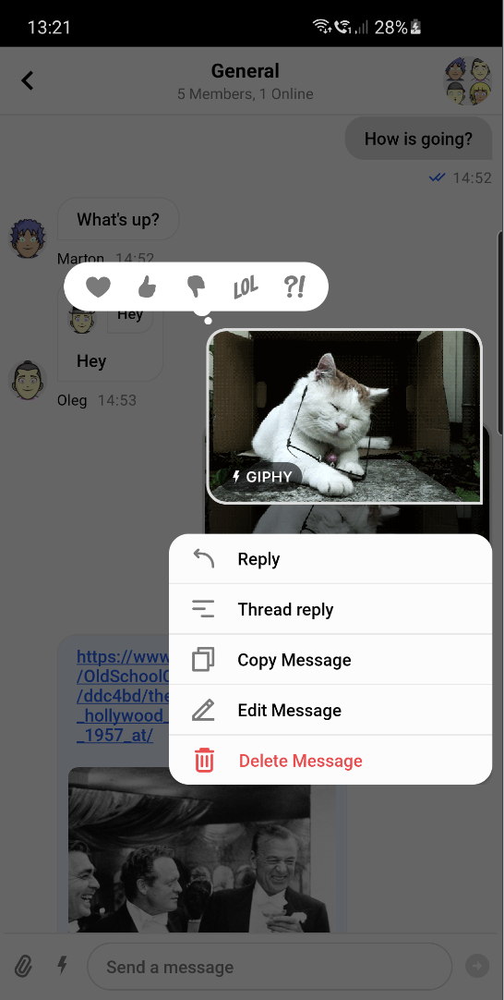
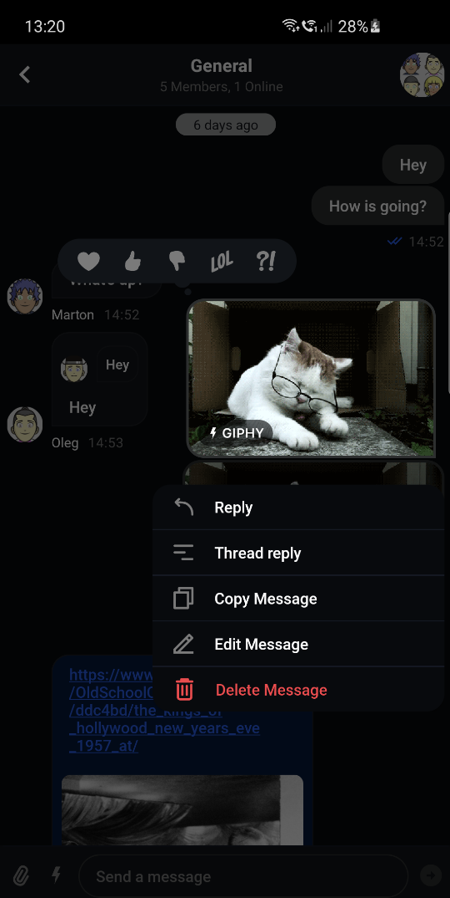
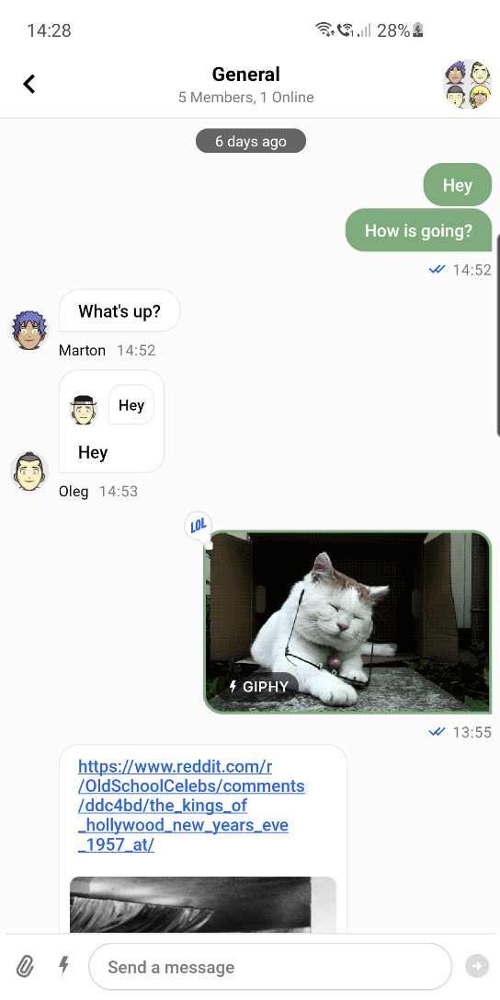
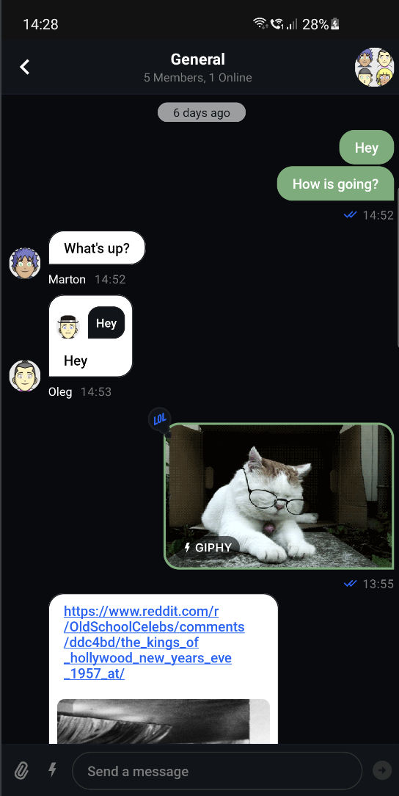
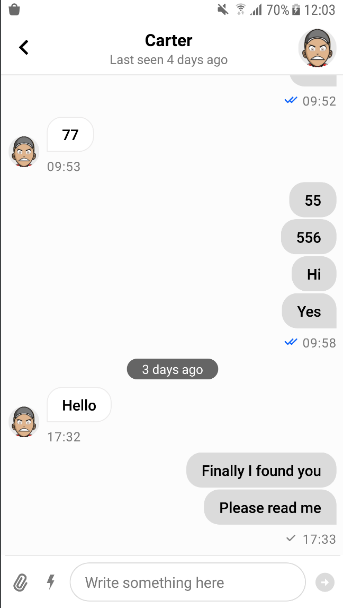
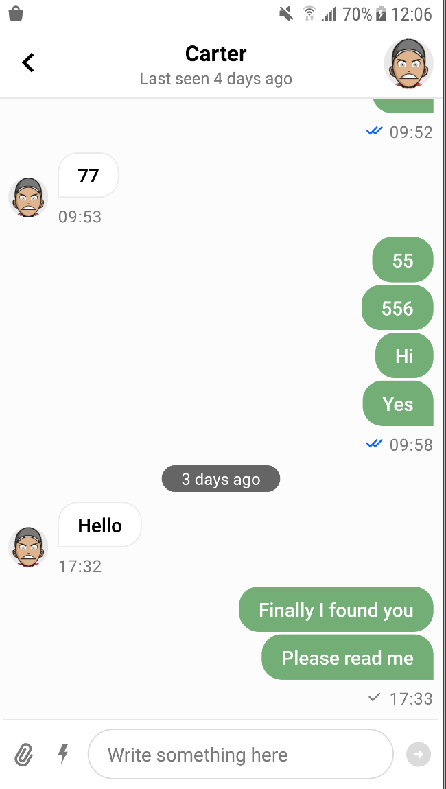
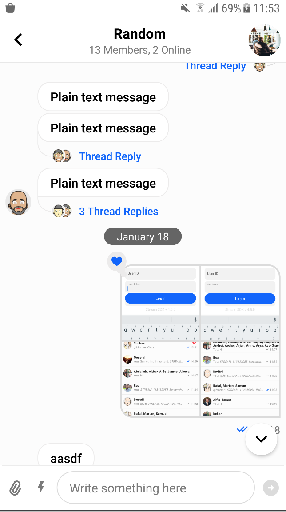
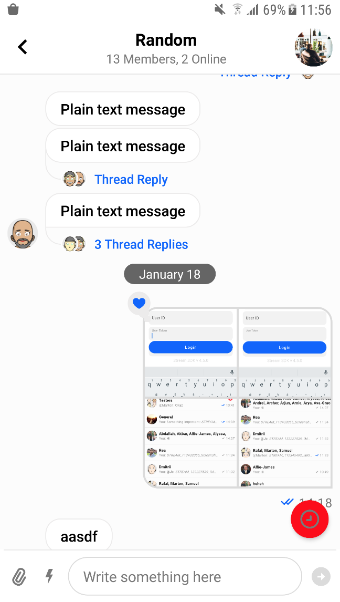

# Message List

<!-- TODO: Import whatever makes sense to import from https://getstream.io/chat/docs/android/message_list_view/?language=kotlin -->

## Overview

<!-- TODO: Brief description and a couple screenshots with default styling. -->

## Handling Actions

`MessageListView` comes with a set of actions out of the box that are available by long-pressing a message. There are multiple available actions:

* Adding reaction
* Replies
* Thread replies
* Copy message
* Edit message (if you are an owner)
* Delete message (if you are an owner)
* Flag message (if it doesn't belong to you)
* Mute user who sends a message (if it doesn't belong to you)
* Block user who sends a message (if it doesn't belong to you)

| Light Mode | Dark Mode |
| --- | --- |
|||

Most of the actions work out of the box but you can change their behavior using different listeners and handlers:

```kotlin
messageListView.setMessageClickListener { message ->
    // Handle message click
}
messageListView.setAttachmentClickListener { message, attachment ->
    // Handle attachment click
}
messageListView.setMessageEditHandler { message ->
    // Handle edit message
}
messageListView.setMessageDeleteHandler { message ->
    // Handle edit message
}
messageInputView.setOnSendButtonClickListener {
    // Handle send button click
}
```

The full lists of available listeners and handlers are available [here (MessageListView)](https://getstream.github.io/stream-chat-android/stream-chat-android-ui-components/stream-chat-android-ui-components/io.getstream.chat.android.ui.message.list/-message-list-view/index.html).

## Customizations

It is possible to change the style in two ways: using XML and programmatically.

### Customization with XML Attributes

<!-- TODO: Make this section better. -->

Let's change the style of messages sent by the current user.

| Light Mode | Dark Mode |
| --- | --- |
|||

In order to do that, we need to add additional attributes to `MessageListView`:
```xml
    <io.getstream.chat.android.ui.message.list.MessageListView
        android:id="@+id/messageListView"
        android:layout_width="0dp"
        android:layout_height="0dp"
        android:layout_marginHorizontal="0dp"
        android:clipToPadding="false"
        app:layout_constraintBottom_toTopOf="@+id/messageInputView"
        app:layout_constraintEnd_toEndOf="parent"
        app:layout_constraintStart_toStartOf="parent"
        app:layout_constraintTop_toBottomOf="@+id/messagesHeaderView"
        app:streamUiMessageBackgroundColorMine="#70AF74"
        app:streamUiMessageBackgroundColorTheirs="#FFFFFF"
        app:streamUiMessageTextColorMine="#FFFFFF"
        app:streamUiMessageTextColorTheirs="#000000"
        />
```

### Customization at Runtime

<!-- TODO: Make this section better. -->

Both `MessageListView` and its ViewHolders can be configured programmatically (a list of supported customizations can be found [here](https://getstream.github.io/stream-chat-android/stream-chat-android-ui-components/stream-chat-android-ui-components/io.getstream.chat.android.ui.message.list/-message-list-view-style/index.html) and [here](https://getstream.github.io/stream-chat-android/stream-chat-android-ui-components/stream-chat-android-ui-components/io.getstream.chat.android.ui.message.list/-message-list-item-style/index.html)).

As an example, let's apply the green style from the previous section, but this time programmatically:

| Before | After |
| --- | --- |
|||

We are going to use custom _TransformStyle.messageListItemStyleTransformer_:
```kotlin
TransformStyle.messageListItemStyleTransformer = StyleTransformer { defaultViewStyle ->
    defaultViewStyle.copy(
        messageBackgroundColorMine = Color.parseColor("#70AF74"),
        messageBackgroundColorTheirs = Color.WHITE,
        textStyleMine = defaultViewStyle.textStyleMine.copy(color = Color.WHITE),
        textStyleTheirs = defaultViewStyle.textStyleTheirs.copy(color = Color.BLACK),
    )
}
```

Note: The transformers should be set before the views are rendered to make sure that the new style was applied.

As another example, let's modify the default view which allows scrolling to the bottom when the new message arrives:

| Before | After |
| --- | --- |
|||

To achieve such effect we need to provide custom _TransformStyle.messageListStyleTransformer_:
```kotlin
TransformStyle.messageListStyleTransformer = StyleTransformer { defaultViewStyle ->
    defaultViewStyle.copy(
        scrollButtonViewStyle = defaultViewStyle.scrollButtonViewStyle.copy(
            scrollButtonColor = Color.RED,
            scrollButtonUnreadEnabled = false,
            scrollButtonIcon = ContextCompat.getDrawable(requireContext(), R.drawable.stream_ui_ic_clock)!!,
        ),
    )
}
```


## Creating a Custom Empty State

<!-- TODO: Review this example, possibly remove it. -->

2. Set new empty state view to _MessageListView_:
```kotlin
val textView = TextView(context).apply {
    text = "There are no messages yet"
    setTextColor(Color.GREEN)
}
messageListView.setEmptyStateView(
    view = textView,
    layoutParams = FrameLayout.LayoutParams(
        FrameLayout.LayoutParams.WRAP_CONTENT,
        FrameLayout.LayoutParams.WRAP_CONTENT,
        Gravity.CENTER
     )
)
```
